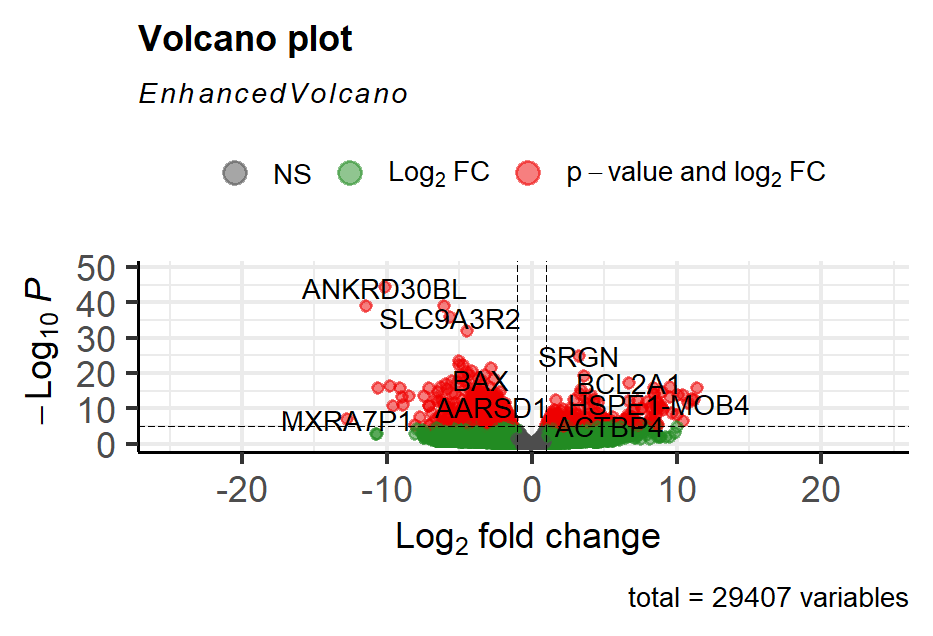
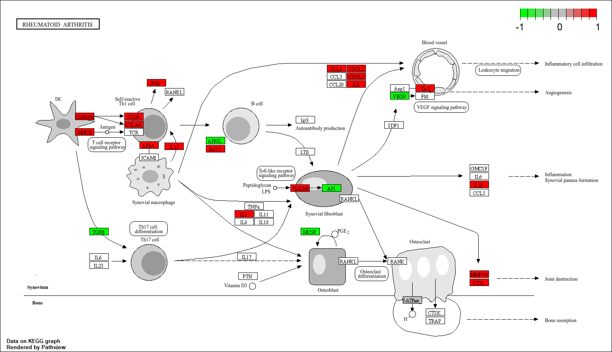

<h1 align="center">
Transcriptomics analyse van Rheumatoïde Artritis
</h1>

<strong>Auteur:</strong> Fabian Le Pelvé 
<strong>Datum:</strong> 19 Juni 2026

# Inhoud

- `images/' - zijn de gebruikte figuren voor dit project
- `Data_RAW/` - ruwe data van controle groepen e patient groepen
- `scripts/` - R script
- `Hs_referentie/` - is het gebruikte referentie genoom voor dit project

# Transcriptomics

Inleiding 

Reumatoïde artritis (RA) is een auto-immuunziekte die gepaard gaat met een
chronisch ontstekingsproces dat zowel de gewrichten als organen buiten de
gewrichten kan aantasten, zoals het hart, de longen en het zenuwstelsel. Er bestaan
verschillende vormen van artritis, die kunnen worden onderverdeeld in niet-
ontstekingsgebonden artritis, zoals artrose, en ontstekingsgebonden artritis. Deze
ontstekingen kunnen ontstaan door kristalafzetting, bacteriële of virale infecties of
door auto-immuunprocessen. Ongeveer 0,3–1% van de wereldbevolking lijdt aan

deze ziekte, waarbij vrouwen vaker getroffen worden dan mannen (Radu &amp; Bungau,
2021; Platzer et al., 2019).

De oorzaak van RA is nog niet volledig bekend. Waarschijnlijk is het geen gevolg van
één enkele factor, maar van een combinatie van genetische variaties, veranderingen
in genexpressie, auto-immuniteit en omgevingsinvloeden. Hierdoor is er nog geen
behandeling die de ziekte volledig kan genezen (Platzer et al., 2019).

In dit onderzoek zijn vier monsters van patiënten met een RA-diagnose van meer dan
twaalf maanden en vier controles onderzocht. De monsters zijn afkomstig van
gewrichtsslijmvlies. Met behulp van RStudio is een transcriptomics-analyse
uitgevoerd om te bepalen welke genen meer of minder tot expressie komen.
Daarnaast is onderzocht welke biologische pathways hierbij betrokken zijn met
behulp van een Gene Ontology-analyse.

Het doel van dit onderzoek is om inzicht te krijgen in de genen en pathways die
betrokken zijn bij reumatoïde artritis en zo bij te dragen aan een beter begrip van de
moleculaire processen achter deze ziekte.

Methode 
Voor dit onderzoek naar reumatoïde artritis (RA) werd RNA-sequencing data van
synoviumbiopten geanalyseerd van vier gezonde controles en vier RA-patiënten met
meer dan 12 maanden diagnose De controlegroep was ACPA-negatief en de RA-
groep ACPA-positief. De ruwe sequencingbestanden (FASTQ) werden uitgelijnd op
het humane referentiegenoom (GRCh38) met behulp van de align-functie uit het
Rsubread-pakket, na het aanmaken van een index. Hierna werden de resulterende
BAM-bestanden gesorteerd en geïndexeerd met Rsamtools.

De genexpressie werd gekwantificeerd met featureCounts op basis van een GTF-
annotatiebestand. De differentiële genexpressieanalyse werd uitgevoerd in DESeq2,
waarbij een model werd gebruikt op basis van de behandelconditie (RA vs. controle).
Significante genen werden geselecteerd bij een aangepaste p-waarde &lt; 0.05 en een
|log2FoldChange| &gt; 1.

Vervolgens werd een Gene Ontology-analyse uitgevoerd met clusterProfiler om
betrokken biologische processen te identificeren, apart voor verhoogde en verlaagde
genen. Resultaten werden visueel weergegeven via ggplot2 en een

EnhancedVolcano-plot. Tot slot werd pathway-analyse verricht met behulp van het
pathview-pakket op geselecteerde KEGG-pathways.

#Resultaten
Om verschillen in genexpressie tussen patiënten met reumatoïde artritis (RA) en gezonde controles te identificeren, werd een differentiële expressieanalyse uitgevoerd met DESeq2. De resultaten werden weergegeven in een volcano plot (Figuur 1). Hierin zijn genen met een significante verandering in expressie zichtbaar. In totaal werden 4572 differentieel tot expressie gebrachte genen gevonden (padj < 0,05 en |log2FoldChange| > 1). Hiervan waren 2085 genen verhoogd tot expressie gebracht in de RA-groep en 2487 genen verlaagd tot expressie gebracht ten opzichte van de controlegroep.

De GO-analyse werd uitgevoerd op de significant veranderde genen. De meest voorkomende processen waren voornamelijk gerelateerd aan immuunfuncties, waaronder activatie van lymfocyten, regulatie van immuunresponsen en migratie van immuuncellen (Figuur 2). Deze processen zijn kenmerkend voor chronische ontstekingsreacties zoals die voorkomen bij RA.
Daarnaast werd er ook een KEGG-pathwayanalyse uitgevoerd. Hierbij werd onder andere het pathway Rheumatoid arthritis (hsa05323) onderzocht met behulp van pathview (Figuur 3). Binnen deze pathway werden meerdere genen met verhoogde en verlaagde expressie zichtbaar, wat wijst op verstoringen in ontstekings- en immuun signaalroutes die betrokken zijn bij het ziekteproces van RA.

#GO analyse 

#KEGG Pathway analyse

